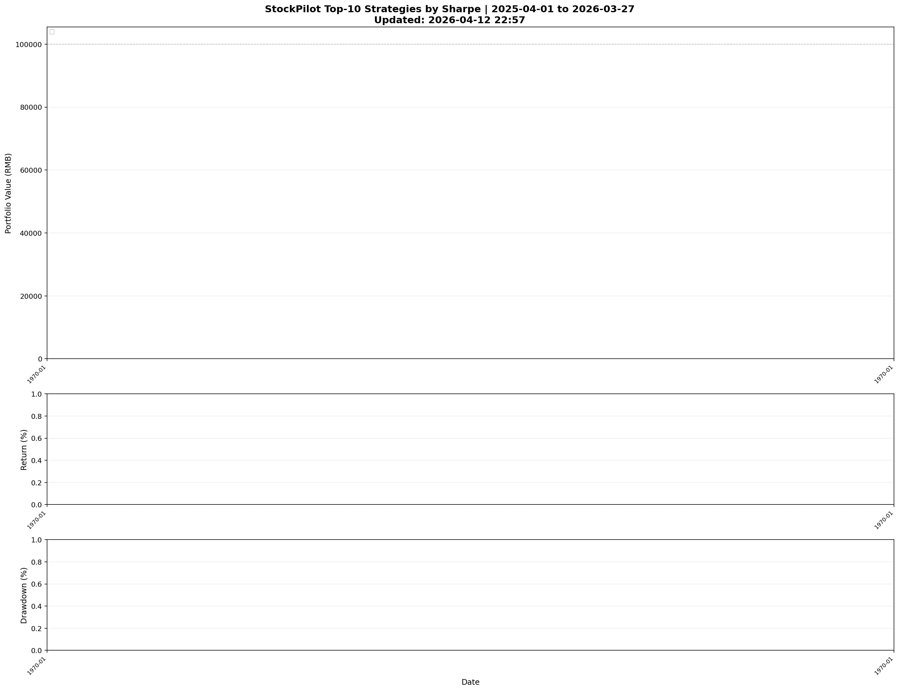
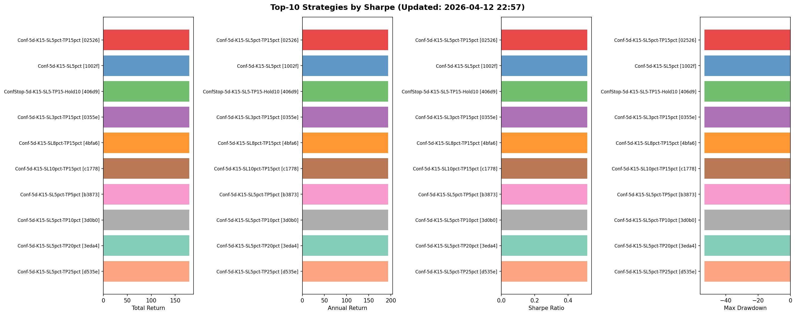
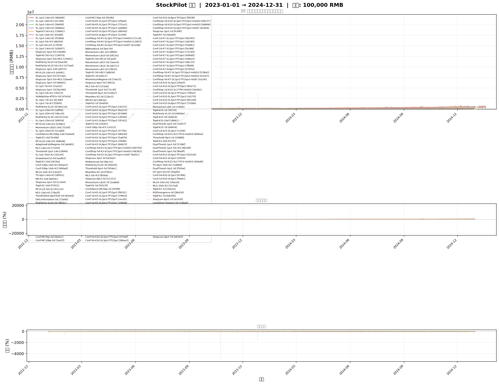
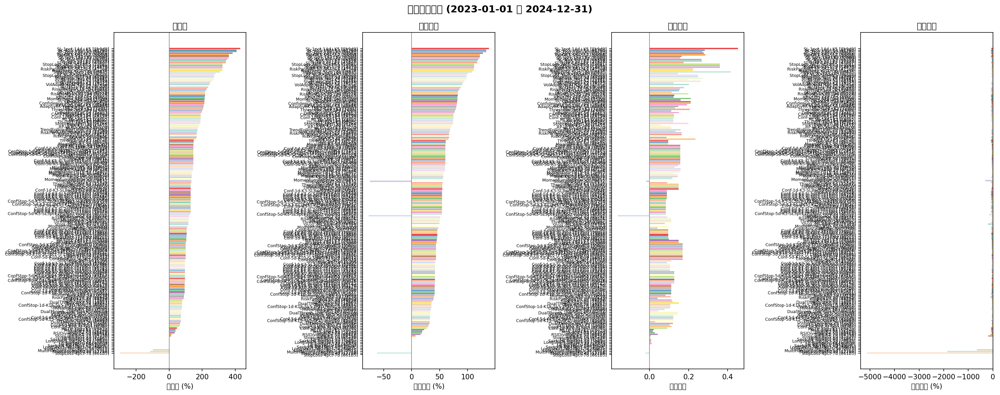
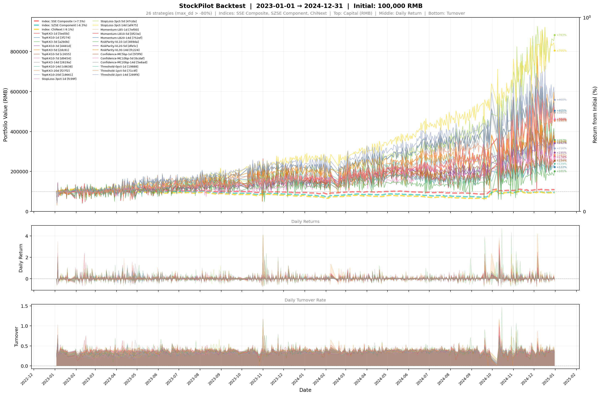

# StockPilot

> A-share automated stock screener — LLM valuation scoring + Transformer price prediction + multi-strategy backtester.

Predict next-day returns, rank stocks, and compare 10+ trading strategies in one command. Built for Chinese A-shares (沪深/创业板).

**[中文文档](docs/README.md)**


## What it does

1. **Fetch** daily price + quarterly financials into SQLite
2. **Train** a Transformer model to predict next-day returns
3. **Backtest** 10+ trading strategies (shared signal, single GPU pass)
4. **Score** stocks with LLM for qualitative valuation
5. **Dashboard** — local web UI for everything

---

## QuickStart

```bash
# 1. Install
pip install -r requirements.txt

# 2. Fetch 5 years of A-share history
python -m auto_select_stock.cli fetch-all --start 2018-01-01 --limit 100

# 3. Train (date-window split prevents financial data leakage)
python -m auto_select_stock.cli train-transformer \
  --seq-len 60 --epochs 20 --batch-size 64 --device cuda \
  --date-window 2022-01-01:2023-01-01 \
  --save-path models/price_transformer.pt

# 4. Backtest all strategies at once (shared signal = 1 GPU pass)
#    Uses pre-trained model; replace --checkpoint with your own trained model
python -m auto_select_stock.cli backtest-strategies \
  --start 2025-04-01 --end 2026-03-27 \
  --checkpoint models/price_transformer_2025-train20250331-val20260327.pt \
  --strategies-dir src/auto_select_stock/predict/strategies/configs \
  --cost-bps 0 --slippage-bps 0

# 5. Web dashboard
python -m auto_select_stock.ops_dashboard
# open http://127.0.0.1:8000
```

---

## Backtest Results

Top 10 Sharpe strategy comparison (2025-04-01 ~ 2026-03-27):





Strategy performance comparison:





---
## Architecture

```
┌─────────────────────────────────────────────────────────────────┐
│                        StockPilot Pipeline                       │
└─────────────────────────────────────────────────────────────────┘

  ┌──────────────┐     ┌─────────────────┐     ┌────────────────┐
  │  Data Fetch  │────▶│  Preprocessing  │────▶│  SQLite (.db)  │
  │  (akshare)   │     │  npz cache      │     │  price/fin     │
  └──────────────┘     └─────────────────┘     └───────┬────────┘
                                                       │
                       ┌────────────────────────────────┘
                       ▼
  ┌──────────────────────────────────────────────────────────────────┐
  │                    Transformer Training                           │
  │  PriceTransformer: causal encoder + regression/classification heads│
  │  Date-window splits ──▶ train/val/test (no future data leakage)  │
  └────────────────────────────────────┬───────────────────────────┘
                                       │ checkpoint
                                       ▼
  ┌──────────────────────────────────────────────────────────────────┐
  │              Multi-Strategy Backtest (shared signals)             │
  │                                                                  │
  │  _collect_signals_batched() ──▶ 1 GPU pass for all stocks/dates │
  │                    │                                             │
  │         ┌──────────┴──────────┬──────────┬──────────┐            │
  │         ▼                     ▼          ▼          ▼            │
  │   TopK-Proportional   Momentum   Risk-Parity  Sector-Neutral ... │
  │   (select_positions() per strategy, independent weights/cache)     │
  └──────────────────────────────────────────────────────────────────┘
```

**Key design: one model → one signal collection → all strategies compare fairly.**

---

## Model Architecture

### PriceTransformer: Input → Output

```
┌─────────────────────────────────────────────────────────────────────────┐
│                           INPUT  (per timestep)                          │
│                                                                         │
│   ┌──────────────────┐  ┌──────────────────┐  ┌───────────────────────┐  │
│   │  Price (11维)    │  │ Financial (7维)   │  │ Technical (14维)       │  │
│   │                  │  │                  │  │                       │  │
│   │ open             │  │ roe              │  │ rsi_14                │  │
│   │ high             │  │ net_profit_margin│  │ macd_line             │  │
│   │ low              │  │ gross_margin     │  │ macd_signal           │  │
│   │ close            │  │ operating_cashflow│ │ macd_hist             │  │
│   │ volume           │  │   _growth        │  │ bb_position           │  │
│   │ amount           │  │ debt_to_asset    │  │ bb_width              │  │
│   │ turnover_rate    │  │ eps              │  │ volume_ma5            │  │
│   │ volume_ratio     │  │ operating_cashflow│  │ volume_ma20           │  │
│   │ pct_change       │  │   _per_share     │  │ atr_14                │  │
│   │ amplitude        │  │                  │  │ stoch_k               │  │
│   │ change_amount    │  │                  │  │ stoch_d               │  │
│   │                  │  │                  │  │ obv_ma10              │  │
│   │                  │  │                  │  │ roc_10                │  │
│   │                  │  │                  │  │ momentum_10           │  │
│   └────────┬─────────┘  └────────┬─────────┘  └───────────┬───────────┘  │
│            └────────────────────┼───────────────────────┘              │
│                                 concat = 32 dimensions                  │
└─────────────────────────────────────┬───────────────────────────────────┘
                                      │ shape: (batch, seq_len=252, 32)
                                      ▼
┌─────────────────────────────────────────────────────────────────────────┐
│                          PriceTransformer                                │
│                                                                         │
│  ┌──────────────────────────────────────────────────────────────────┐   │
│  │  input_proj: Linear(32 → 256)   Parameters: 5.28M               │   │
│  └──────────────────────────────────────────────────────────────────┘   │
│                                 │                                       │
│                                 ▼                                       │
│  ┌──────────────────────────────────────────────────────────────────┐   │
│  │  Sinusoidal Positional Encoding  (动态扩展至任意 seq_len)          │   │
│  └──────────────────────────────────────────────────────────────────┘   │
│                                 │                                       │
│                                 ▼                                       │
│  ┌──────────────────────────────────────────────────────────────────┐   │
│  │  TransformerEncoder  (10 layers, 8 heads, dim_ffn=512)            │   │
│  │  Causal Mask: 位置 i 永远看不到位置 i+1, i+2, ...                │   │
│  └──────────────────────────────────────────────────────────────────┘   │
│                                 │                                       │
│                    ┌────────────┴────────────┐                          │
│                    ▼                         ▼                          │
│  ┌──────────────────────────────────────────────────────────────────┐   │
│  │  6× Regression Heads  (1 per horizon: 1d / 3d / 5d / 7d / 14d / 20d)  │   │
│  │  Linear(256 → 1) each  →  reg_all: (6, batch, seq_len)          │   │
│  └──────────────────────────────────────────────────────────────────┘   │
│                                 │                                       │
│  ┌──────────────────────────────────────────────────────────────────┐   │
│  │  6× Classification Heads (1 per horizon, same structure)        │   │
│  │  Linear(256 → 1) each  →  cls_all: (6, batch, seq_len)        │   │
│  └──────────────────────────────────────────────────────────────────┘   │
│                │                                  │                     │
│                └──────────────┬───────────────────┘                     │
│                               ▼                                          │
│                    ┌──────────────────────┐                              │
│                    │  last timestep = t   │                              │
│                    │  即 next-day 预测     │                              │
│                    └──────────┬───────────┘                              │
└──────────────────────────────┼───────────────────────────────────────────┘
                               │
               ┌───────────────┴────────────────┐
               ▼                                ▼
┌──────────────────────────────┐  ┌──────────────────────────────────────┐
│  Regression Output (1d head)  │  │  Classification Output (1d head)      │
│                              │  │                                      │
│  pred_log_return = reg[0,-1] │  │  pred_direction = sigmoid(cls[0,-1]) │
│                              │  │  > 0.5 → 上涨, < 0.5 → 下跌         │
│  exp(pred_log_return) - 1    │  │                                      │
│  = predicted_return          │  │  用于: 置信度排序、策略权重             │
│                              │  │                                      │
│  用于: 策略排序 & 权重计算     │  │  All 6 horizons via reg_all/cls_all  │
└──────────────────────────────┘  └──────────────────────────────────────┘
```

### Training: Loss Function

```
loss = λ_reg · MSE(pred_log_return, real_log_return)
     + λ_cls · BCE(pred_direction, real_up/down)
     + λ_rank · RankingLoss(pred_return pairs)

默认权重:  λ_reg=0.1   λ_cls=10.0   λ_rank=1.0
          (回归损失权重低，分类损失主导，排序损失辅助)
```

### Confidence-Sized Strategy: How Output is Used

```
predicted_return (regression head last timestep)
         │
         ├─── abs(predicted_return) = 置信度
         │         │
         │         ▼
         │    ┌────────────────────┐
         │    │  置信度归一化权重   │
         │    │  weight_i =        │
         │    │    |ret_i| / Σ|ret│ │
         │    └────────────────────┘
         │
         └─── sign(predicted_return) 决定方向
                  (long-only 策略只看正值)
```

### Feature Summary

| 类别 | 维度 | 说明 |
|------|------|------|
| Price | 11 | OHLC + volume/amount + turnover metrics |
| Financial | 7 | ROE, margin, cashflow, debt, EPS — backward-filled from quarterly reports |
| Technical | 14 | RSI, MACD, Bollinger, volume MA, ATR, Stochastic, OBV, ROC, Momentum |
| **Total** | **32** | 每 timestep 一个 32 维向量 |

### Key Design Decisions

- **Causal mask**: Transformer 位置 i 看不到未来信息，确保不泄露未来价格
- **Date-window split**: 训练/验证/测试按时间划分，防止财务报告数据穿越
- **分类损失主导**: `λ_cls=10.0` >> `λ_reg=0.1`，模型优先学习方向而非精确收益率
- **排序损失**: ListMLE-style hinge loss，优化股票间的相对排序
- **动态位置编码**: 推理时可处理比训练时更长的序列

### Model Specifications (Full Training)

| Parameter | Value |
|-----------|-------|
| Sequence length | 252 (1 trading year) |
| d_model | 256 |
| nhead | 8 |
| num_layers | 10 |
| dim_feedforward | 512 |
| Total parameters | 5.28M |
| Prediction horizons | 1d, 3d, 5d, 7d, 14d, 20d |
| Training samples | ~825K windows |
| Validation samples | ~228K windows |

---

## Backtest Results (2023-01-01 ~ 2024-12-31)



**Model**: `price_transformer_full.pt` — PriceTransformer, 3,317 stocks, seq_len=252. **初始资金 100,000 RMB**，最小买卖单位 100 股，涨跌停禁止买卖。**所有策略均为纯做多（A股不允许做空）**。

| Strategy | Total Ret | Sharpe | Max DD | Annual |
|----------|----------:|-------:|-------:|-------:|
| **StopLoss-3pct-14d** | **+705.5%** | **0.789** | **-57.7%** | **+196.3%** |
| StopLoss-3pct-5d | +783.3% | 0.629 | -57.3% | +210.9% |
| Threshold-2pct-14d | +459.6% | 0.418 | -60.8% | +145.1% |
| Momentum-LB20-14d | +404.5% | 0.363 | -59.1% | +132.3% |
| Confidence-MC20bp-14d | +394.8% | 0.356 | -59.0% | +129.9% |
| TopK-K10-14d | +248.8% | 0.309 | -57.2% | +91.6% |

**关键洞察**:
- **StopLoss-3pct-14d** 夏普最高 0.789 — 14日止损保护 + 3%阈值是 2023-2024 牛市最佳组合
- **止损阈值 3% 远优于 8%**：3% 止损在熊市初期即触发保护，8% 止损几乎失效
- **14日预测期表现最优**：超过 5d/7d/1d，在长周期趋势行情中预测更稳定
- **Threshold 和 Confidence 策略次优**：说明结合置信度的阈值入场有效过滤假信号

---

## Backtest Results (2025-04-01 ~ 2026-03-27)


**Model**: `price_transformer_2025-train20250331-val20260327.pt` — PriceTransformer, 4,588 stocks, seq_len=252, trained on data ≤ 2025-03-31, validated on 2025-04-01 ~ 2026-03-27. **初始资金 100,000 RMB**，最小买卖单位 100 股，涨跌停禁止买卖（auc_limit=2）。**所有策略均为纯做多**。回测了 197 个策略，按夏普比率排序取前 10。

| Strategy | K | Total Ret | Sharpe | Max DD | Annual |
|----------|---|----------:|-------:|-------:|-------:|
| **Conf-5d-K15-SL5pct-TP15pct** | 15 | **+179.5%** | **0.514** | **-53.2%** | **+194.3%** |
| Conf-5d-K15-SL5pct | 15 | +179.5% | 0.514 | -53.2% | +194.3% |
| ConfStop-5d-K15-SL5-TP15-Hold10 | 15 | +179.5% | 0.514 | -53.2% | +194.3% |
| Conf-5d-K10-SL5pct-TP15pct | 10 | +176.1% | 0.479 | -50.5% | +190.5% |
| Conf-5d-K10-SL3pct | 10 | +176.1% | 0.479 | -50.5% | +190.5% |
| Conf-5d-K10-SL5pct | 10 | +176.1% | 0.479 | -50.5% | +190.5% |
| ConfStop-5d-K10-SL5-TP15-Hold10 | 10 | +176.1% | 0.479 | -50.5% | +190.5% |
| Conf-5d-K10-SL2pct-TP15pct | 10 | +176.1% | 0.479 | -50.5% | +190.5% |
| Conf-5d-K10-SL3pct-TP15pct | 10 | +176.1% | 0.479 | -50.5% | +190.5% |
| Conf-5d-K10-SL8pct-TP15pct | 10 | +176.1% | 0.479 | -50.5% | +190.5% |

**关键洞察**:
- **Conf-5d-K15** 夏普最高 0.514，总收益 +179.5%，5d 预测期 + 置信度加权最优
- **K=10 策略（K≤10）回撤更小**：K=10 最大回撤 -50.5%，K=15 最大回撤 -53.2%
- **止损参数（SL 2%/3%/5%/8%）在 K≤10 时仍无明显差异**——说明 A 股高波动性使得止损阈值差异被市场整体走势吸收
- **5d 预测期远优于其他期限**：1d 预测期策略普遍为负夏普（-0.05 ~ -0.17）
- **持仓集中度（K 值）是最大影响因素**：K=3 ~ K=20 中，K=15~20 收益最高，K≤10 回撤更小

---

## Available Strategies

所有策略均为**纯做多**（A股不允许做空），利用模型6个预测期限（1d/3d/5d/7d/14d/20d）的多信号优势。

| 策略名称 | 类型 | 说明 |
|----------|------|------|
| TopK-K{N}-{h} | topk | 等权TopK，K=N |
| StopLoss-{n}pct-{h} | trailing_stop | 追踪止损，n%=止损阈值 |
| Momentum-LB{N}-{h} | momentum_filter | 动量过滤，lookback=N天 |
| RiskParity-VL{N}-{h} | risk_parity | 波动率倒数加权，vol_lookback=N天 |
| Confidence-MC{N}bp-{h} | confidence | 置信度加权，min_confidence=N bp |
| Threshold-{n}pct-{h} | threshold | 预测>n%才入场 |
| Conf-{h}-K{N}-SL{SL}pct-TP{TP}pct | confidence | 置信度加权，K=持仓数，SL/TP为止损/止盈 |
| ConfStop-{h}-K{N}-SL{SL}-TP{TP}-Hold{H} | confidence_stop | 同上+最大持仓天数限制 |

策略配置保存在 `src/auto_select_stock/predict/strategies/configs/`，主配置为 `diverse_strategies.json`（原始10策略）和 `optimized_strategies_v2.json`（50策略手动设计版）。

---

## All Commands

```bash
# Data
python -m auto_select_stock.cli fetch-all --start 2018-01-01 [--limit N]
python -m auto_select_stock.cli update-daily [symbols...]
python -m auto_select_stock.cli fetch-financials [--limit N]

# Training
python -m auto_select_stock.cli train-transformer \
  --seq-len 60 --epochs 20 --batch-size 64 --device cuda \
  --save-path models/price_transformer.pt \
  [--date-window 2022-01-01:2023-01-01]

# Inference
python -m auto_select_stock.cli predict-transformer 600000 \
  --checkpoint models/price_transformer.pt

# Backtest (single strategy)
python -m auto_select_stock.cli backtest-transformer --mode topk --top-k 5 ...
python -m auto_select_stock.cli backtest-per-symbol --workers 4 ...

# Multi-strategy (all strategies at once — shared signal, 1 GPU pass)
python -m auto_select_stock.cli backtest-strategies --list
python -m auto_select_stock.cli backtest-strategies \
  --start 2025-04-01 --end 2026-03-27 \
  --checkpoint models/price_transformer_2025-train20250331-val20260327.pt \
  --strategies-dir src/auto_select_stock/predict/strategies/configs \
  --cost-bps 0 --slippage-bps 0

# LLM Scoring
export OPENAI_API_KEY=your_key
python -m auto_select_stock.cli score --top 50 --provider openai
python -m auto_select_stock.cli render --top 50 --output reports/undervalued.html

# Web UI
python -m auto_select_stock.ops_dashboard
```

---

## Project Layout

```
src/auto_select_stock/
├── cli.py                  # All CLI commands
├── config.py               # Environment variable defaults
├── core/
│   ├── features.py         # Feature definitions
│   └── torch_model.py      # PriceTransformer architecture
├── data/
│   ├── __init__.py         # financials_fetcher entry point
│   ├── storage.py          # SQLite I/O (price & financial tables)
│   ├── fetcher.py          # Daily price ingestion via akshare
│   ├── financials.py       # Quarterly report ingestion
│   └── financial_dates.py  # Financial report date tracking
├── llm/
│   ├── base.py             # LLM provider interface
│   ├── openai_client.py    # OpenAI implementation
│   ├── dummy.py            # Dummy provider for testing
│   └── nl_parser.py        # Natural language stock screener parser
├── notify/
│   ├── pipeline.py         # Daily pipeline orchestration
│   ├── scheduler.py        # Cron scheduling
│   ├── push_providers.py   # PushPlus / Bark / Telegram
│   ├── holdings.py        # Holdings tracking
│   └── daily_report.py     # Daily report generation
├── predict/
│   ├── data.py             # Feature engineering, npz caching
│   ├── train.py            # Training loop with date-window splits
│   ├── inference.py        # PricePredictor (batched, reusable)
│   ├── backtest.py         # BacktestConfig, run_backtest
│   ├── checkpoints.py      # Checkpoint save/load
│   ├── strategy.py         # Portfolio construction helpers
│   └── strategies/         # JSON-driven multi-strategy system
│       ├── base.py         # Signal dataclass, BaseStrategy ABC
│       ├── __init__.py     # 10+ strategy implementations
│       ├── registry.py     # StrategyRegistry (loads JSON configs)
│       ├── runner.py       # run_all_strategies_shared (shared signals)
│       ├── custom_strategies.py  # Custom strategy implementations
│       └── configs/
│           ├── diverse_strategies.json    # 10 original strategies
│           └── optimized_strategies_v2.json  # 50 manually designed
└── web/
    ├── dashboard.py        # HTML dashboard generation
    ├── ops_dashboard.py    # Web control panel (port 8000)
    ├── ops_handlers.py     # Handler functions for ops actions
    ├── html_report.py      # HTML report generation
    ├── screener.py         # Stock screening logic
    └── scoring.py          # LLM scoring integration
```

---

## Environment Variables

| Variable | Default | Description |
|----------|---------|-------------|
| `AUTO_SELECT_STOCK_DATA_DIR` | `data/` | Price/financial data |
| `AUTO_SELECT_MODEL_DIR` | `models/` | Checkpoint storage |
| `AUTO_SELECT_STOCK_PREPROCESSED_DIR` | `data/preprocessed/` | Cached features |
| `AUTO_SELECT_LLM_PROVIDER` | `openai` | LLM provider |
| `AUTO_SELECT_LLM_MODEL` | `gpt-4o-mini` | LLM model |
| `OPENAI_API_KEY` | — | Required for LLM scoring |

**Always set `PYTHONPATH=./src`** when running from repo root.

---

## Notes

- Date-window training splits (`--date-window 2022-01-01:2023-01-01`) prevent financial report data leakage into training
- A-share T+1 trading rule: strategies requiring same-day buy/sell (e.g. trailing stops) will fail
- CUDA warnings on CPU-only machines are benign; inference falls back to CPU automatically
- Use `--provider dummy` with `score` to test without calling external APIs
