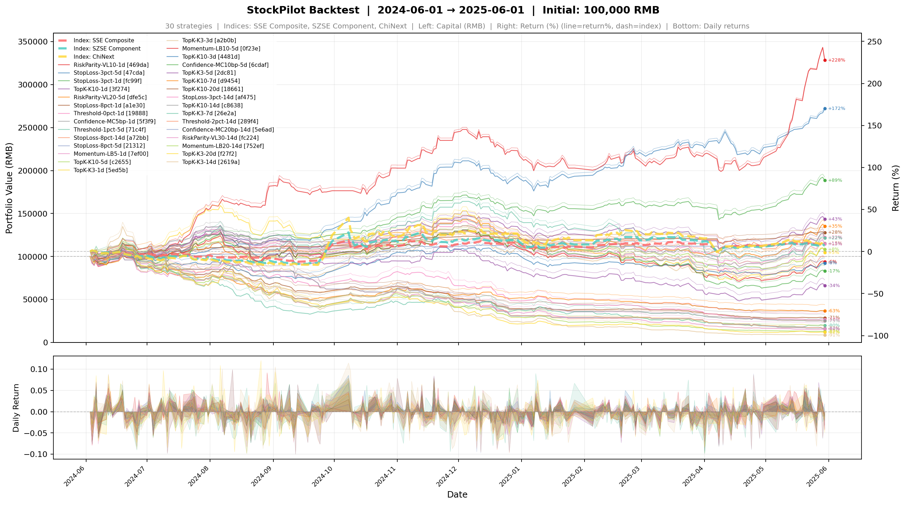

# StockPilot

> A-share automated stock screener — LLM valuation scoring + Transformer price prediction + multi-strategy backtester.

Predict next-day returns, rank stocks, and compare 10+ trading strategies in one command. Built for Chinese A-shares (沪深/创业板).

**[中文文档](docs/README.md)**


## What it does

1. **Fetch** daily price + quarterly financials into SQLite
2. **Train** a Transformer model to predict next-day returns
3. **Backtest** 10+ trading strategies (shared signal, single GPU pass)
4. **Score** stocks with LLM for qualitative valuation
5. **Dashboard** — local web UI for everything

---

## QuickStart

```bash
# 1. Install
pip install -r requirements.txt

# 2. Fetch 5 years of A-share history
python -m auto_select_stock.cli fetch-all --start 2018-01-01 --limit 100

# 3. Train (date-window split prevents financial data leakage)
python -m auto_select_stock.cli train-transformer \
  --seq-len 60 --epochs 20 --batch-size 64 --device cuda \
  --date-window 2022-01-01:2023-01-01 \
  --save-path models/price_transformer.pt

# 4. Backtest all 10 strategies at once (shared signal = 1 GPU pass)
python -m auto_select_stock.cli backtest-strategies \
  --start 2023-01-01 --end 2024-12-31 \
  --checkpoint models/price_transformer.pt \
  --cost-bps 15 --slippage-bps 10

# 5. Web dashboard
python -m auto_select_stock.ops_dashboard
# open http://127.0.0.1:8000
```

---

## Architecture

```
┌─────────────────────────────────────────────────────────────────┐
│                        StockPilot Pipeline                       │
└─────────────────────────────────────────────────────────────────┘

  ┌──────────────┐     ┌─────────────────┐     ┌────────────────┐
  │  Data Fetch  │────▶│  Preprocessing  │────▶│  SQLite (.db)  │
  │  (akshare)   │     │  npz cache      │     │  price/fin     │
  └──────────────┘     └─────────────────┘     └───────┬────────┘
                                                       │
                       ┌────────────────────────────────┘
                       ▼
  ┌──────────────────────────────────────────────────────────────────┐
  │                    Transformer Training                           │
  │  PriceTransformer: causal encoder + regression/classification heads│
  │  Date-window splits ──▶ train/val/test (no future data leakage)  │
  └────────────────────────────────────┬───────────────────────────┘
                                       │ checkpoint
                                       ▼
  ┌──────────────────────────────────────────────────────────────────┐
  │              Multi-Strategy Backtest (shared signals)             │
  │                                                                  │
  │  _collect_signals_batched() ──▶ 1 GPU pass for all stocks/dates │
  │                    │                                             │
  │         ┌──────────┴──────────┬──────────┬──────────┐            │
  │         ▼                     ▼          ▼          ▼            │
  │   TopK-Proportional   Momentum   Risk-Parity  Sector-Neutral ... │
  │   (select_positions() per strategy, independent weights/cache)     │
  └──────────────────────────────────────────────────────────────────┘
```

**Key design: one model → one signal collection → all strategies compare fairly.**

---

## Model Architecture

### PriceTransformer: Input → Output

```
┌─────────────────────────────────────────────────────────────────────────┐
│                           INPUT  (per timestep)                          │
│                                                                         │
│   ┌──────────────────┐  ┌──────────────────┐  ┌───────────────────────┐  │
│   │  Price (12维)    │  │ Financial (7维)   │  │ Technical (14维)       │  │
│   │                  │  │                  │  │                       │  │
│   │ open             │  │ roe              │  │ rsi_14                │  │
│   │ high             │  │ net_profit_margin│  │ macd_line             │  │
│   │ low              │  │ gross_margin     │  │ macd_signal           │  │
│   │ close            │  │ operating_cashflow│ │ macd_hist             │  │
│   │ volume           │  │   _growth        │  │ bb_position           │  │
│   │ amount           │  │ debt_to_asset    │  │ bb_width              │  │
│   │ turnover_rate    │  │ eps              │  │ volume_ma5            │  │
│   │ volume_ratio     │  │ operating_cashflow│  │ volume_ma20           │  │
│   │ pct_change       │  │   _per_share     │  │ atr_14                │  │
│   │ amplitude        │  │                  │  │ stoch_k               │  │
│   │ change_amount    │  │                  │  │ stoch_d               │  │
│   │                  │  │                  │  │ obv_ma10              │  │
│   │                  │  │                  │  │ roc_10                │  │
│   │                  │  │                  │  │ momentum_10           │  │
│   └────────┬─────────┘  └────────┬─────────┘  └───────────┬───────────┘  │
│            └────────────────────┼───────────────────────┘              │
│                                 concat = 33 dimensions                  │
└─────────────────────────────────────┬───────────────────────────────────┘
                                      │ shape: (batch, seq_len=1024, 33)
                                      ▼
┌─────────────────────────────────────────────────────────────────────────┐
│                          PriceTransformer                                │
│                                                                         │
│  ┌──────────────────────────────────────────────────────────────────┐   │
│  │  input_proj: Linear(33 → 256)                                    │   │
│  └──────────────────────────────────────────────────────────────────┘   │
│                                 │                                       │
│                                 ▼                                       │
│  ┌──────────────────────────────────────────────────────────────────┐   │
│  │  Sinusoidal Positional Encoding  (动态扩展至任意 seq_len)          │   │
│  └──────────────────────────────────────────────────────────────────┘   │
│                                 │                                       │
│                                 ▼                                       │
│  ┌──────────────────────────────────────────────────────────────────┐   │
│  │  TransformerEncoder  (10 layers, 8 heads, dim_ffn=512)            │   │
│  │  Causal Mask: 位置 i 永远看不到位置 i+1, i+2, ...                │   │
│  └──────────────────────────────────────────────────────────────────┘   │
│                                 │                                       │
│                    ┌────────────┴────────────┐                          │
│                    ▼                         ▼                          │
│  ┌──────────────────────────────────────────────────────────────────┐   │
│  │  6× Regression Heads  (1 per horizon: 1d / 3d / 5d / 7d / 14d / 20d)  │   │
│  │  Linear(256 → 1) each  →  reg_all: (6, batch, seq_len)          │   │
│  └──────────────────────────────────────────────────────────────────┘   │
│                                 │                                       │
│  ┌──────────────────────────────────────────────────────────────────┐   │
│  │  6× Classification Heads (1 per horizon, same structure)        │   │
│  │  Linear(256 → 1) each  →  cls_all: (6, batch, seq_len)        │   │
│  └──────────────────────────────────────────────────────────────────┘   │
│                │                                  │                     │
│                └──────────────┬───────────────────┘                     │
│                               ▼                                          │
│                    ┌──────────────────────┐                              │
│                    │  last timestep = t   │                              │
│                    │  即 next-day 预测     │                              │
│                    └──────────┬───────────┘                              │
└──────────────────────────────┼───────────────────────────────────────────┘
                               │
               ┌───────────────┴────────────────┐
               ▼                                ▼
┌──────────────────────────────┐  ┌──────────────────────────────────────┐
│  Regression Output (1d head)  │  │  Classification Output (1d head)      │
│                              │  │                                      │
│  pred_log_return = reg[0,-1] │  │  pred_direction = sigmoid(cls[0,-1]) │
│                              │  │  > 0.5 → 上涨, < 0.5 → 下跌         │
│  exp(pred_log_return) - 1    │  │                                      │
│  = predicted_return          │  │  用于: 置信度排序、策略权重             │
│                              │  │                                      │
│  用于: 策略排序 & 权重计算     │  │  All 6 horizons via reg_all/cls_all  │
└──────────────────────────────┘  └──────────────────────────────────────┘
```

### Training: Loss Function

```
loss = λ_reg · MSE(pred_log_return, real_log_return)
     + λ_cls · BCE(pred_direction, real_up/down)
     + λ_rank · RankingLoss(pred_return pairs)

默认权重:  λ_reg=0.1   λ_cls=10.0   λ_rank=1.0
          (回归损失权重低，分类损失主导，排序损失辅助)
```

### Confidence-Sized Strategy: How Output is Used

```
predicted_return (regression head last timestep)
         │
         ├─── abs(predicted_return) = 置信度
         │         │
         │         ▼
         │    ┌────────────────────┐
         │    │  置信度归一化权重   │
         │    │  weight_i =        │
         │    │    |ret_i| / Σ|ret│ │
         │    └────────────────────┘
         │
         └─── sign(predicted_return) 决定方向
                  (long-only 策略只看正值)
```

### Feature Summary

| 类别 | 维度 | 说明 |
|------|------|------|
| Price | 12 | OHLC + volume/amount + turnover metrics |
| Financial | 7 | ROE, margin, cashflow, debt, EPS — backward-filled from quarterly reports |
| Technical | 14 | RSI, MACD, Bollinger, volume MA, ATR, Stochastic, OBV, ROC, Momentum |
| **Total** | **33** | 每 timestep 一个 33 维向量 |

### Key Design Decisions

- **Causal mask**: Transformer 位置 i 看不到未来信息，确保不泄露未来价格
- **Date-window split**: 训练/验证/测试按时间划分，防止财务报告数据穿越
- **分类损失主导**: `λ_cls=10.0` >> `λ_reg=0.1`，模型优先学习方向而非精确收益率
- **排序损失**: ListMLE-style hinge loss，优化股票间的相对排序
- **动态位置编码**: 推理时可处理比训练时更长的序列

---

## Backtest Results (2024-06-01 ~ 2025-06-01)



**Model**: `price_transformer_multihorizon_full.pt` — Multi-horizon Transformer (1d/3d/5d/7d/14d/20d heads), 1,677 stocks, seq_len=1024, trained 3 epochs. **初始资金 100,000 RMB**，最小买卖单位 100 股，涨跌停禁止买卖。**所有策略均为纯做多（A股不允许做空）**。

| Strategy | Tag | Final Capital | Total Ret | Sharpe | Max DD | Avg Turnover |
|----------|-----|-------------:|----------:|-------:|-------:|-------------:|
| **RiskParity-VL10-1d** | **469da** | **328,393** | **+228.4%** | **6.75** | **-19.7%** | 64.9% |
| StopLoss-3pct-5d | 47cda | 272,027 | +172.0% | 6.61 | -16.6% | 63.9% |
| StopLoss-3pct-1d | fc99f | 188,542 | +88.5% | 3.70 | -16.7% | 52.7% |
| TopK-K10-1d | 3f274 | 143,469 | +43.5% | 1.67 | -26.1% | 56.4% |
| RiskParity-VL20-5d | dfe5c | 135,366 | +35.4% | 1.08 | -31.3% | 56.3% |
| StopLoss-8pct-1d | a1e30 | 128,007 | +28.0% | 1.76 | -9.8% | 23.7% |
| StopLoss-8pct-5d | 21312 | 115,103 | +15.1% | 1.48 | -6.1% | 23.6% |
| Momentum-LB5-1d | 7ef00 | 114,655 | +14.7% | 0.44 | -37.1% | 54.4% |
| TopK-K3-3d | a2b0b | 94,026 | -6.0% | -0.14 | -44.7% | 61.0% |
| TopK-K10-14d | c8638 | 25,123 | -74.9% | -2.66 | -75.7% | 46.4% |

**关键洞察**:
- **RiskParity-VL10-1d [469da] (+228%, Sharpe 6.75)** 压倒性优势 — 波动率倒数加权 + 1日预测完美匹配A股高频交易特性
- **止损机制是关键**：StopLoss-3pct-5d (+172%) 远胜 StopLoss-8pct-5d (+15%)，3%止损阈值比8%更有效
- **预测期限越长越危险**：TopK-K3-20d (-88%)、TopK-K3-14d (-91%) 毁灭性亏损，1日/3日预测最可靠
- **每日推送默认使用 RiskParity-VL10-1d [469da] 策略**

> 每笔交易记录（日期/股票/价格/股数/金额）均完整保存在 JSON 结果中，可逐笔回溯分析。

---

## Available Strategies

所有策略均为**纯做多**（A股不允许做空），利用模型6个预测期限（1d/3d/5d/7d/14d/20d）的多信号优势。

| 策略名称 | Tag | 类型 | 说明 |
|----------|-----|------|------|
| TopK-K3-{h} | 5ed5b等 | topk | 等权TopK，K=3 |
| TopK-K10-{h} | 3f274等 | topk | 等权TopK，K=10 |
| StopLoss-{n}pct-{h} | fc99f等 | trailing_stop | 追踪止损，n%=止损阈值 |
| Momentum-LB{n}-{h} | 7ef00等 | momentum_filter | 动量过滤，lookback=n天 |
| RiskParity-VL{n}-{h} | 469da等 | risk_parity | 波动率倒数加权，vol_lookback=n天 |
| Confidence-MC{n}bp-{h} | 5f3f9等 | confidence | 置信度加权，min_confidence=n bp |
| Threshold-{n}pct-{h} | 19888等 | threshold | 预测>n%才入场 |

所有策略tag均为5位MD5 hash（MD5(name:type:horizon:params)[:5]），全局唯一，可用于查询、画图和推送。

> 策略配置保存在 `strategies/configs/diverse_strategies.json`，每个策略tag永久固定。

---

## All Commands

```bash
# Data
python -m auto_select_stock.cli fetch-all --start 2018-01-01 [--limit N]
python -m auto_select_stock.cli update-daily [symbols...]
python -m auto_select_stock.cli fetch-financials [--limit N]

# Training
python -m auto_select_stock.cli train-transformer \
  --seq-len 60 --epochs 20 --batch-size 64 --device cuda \
  --save-path models/price_transformer.pt \
  [--date-window 2022-01-01:2023-01-01]

# Inference
python -m auto_select_stock.cli predict-transformer 600000 \
  --checkpoint models/price_transformer.pt

# Backtest
python -m auto_select_stock.cli backtest-transformer --mode topk --top-k 5 ...
python -m auto_select_stock.cli backtest-per-symbol --workers 4 ...

# Multi-strategy (all 10 at once)
python -m auto_select_stock.cli backtest-strategies --list
python -m auto_select_stock.cli backtest-strategies \
  --start 2023-01-01 --end 2024-12-31 \
  --checkpoint models/price_transformer.pt \
  --cost-bps 15 --slippage-bps 10

# LLM Scoring
export OPENAI_API_KEY=your_key
python -m auto_select_stock.cli score --top 50 --provider openai
python -m auto_select_stock.cli render --top 50 --output reports/undervalued.html

# Web UI
python -m auto_select_stock.ops_dashboard
```

---

## Project Layout

```
src/auto_select_stock/
├── cli.py                 # All CLI commands
├── storage.py             # SQLite I/O (price & financial tables)
├── data_fetcher.py        # Daily price ingestion via akshare
├── financials_fetcher.py   # Quarterly report ingestion
├── scoring.py             # LLM-based stock scoring
├── ops_dashboard.py       # Web control panel (port 8000)
│
└── predict/
    ├── data.py            # Feature engineering, npz caching
    ├── torch_model.py     # PriceTransformer architecture
    ├── train.py           # Training loop with date-window splits
    ├── inference.py       # PricePredictor (batched, reusable)
    ├── backtest.py        # BacktestConfig, run_backtest, _collect_signals_batched
    ├── strategy.py        # build_long_short_portfolio helper
    ├── checkpoints.py     # Checkpoint save/load
    └── strategies/        # v0.0.2: JSON-driven strategy system
        ├── base.py        # Signal dataclass, BaseStrategy ABC
        ├── __init__.py    # 10 strategy implementations
        ├── registry.py    # StrategyRegistry (loads JSON configs)
        ├── runner.py     # run_all_strategies_shared (shared signal collection)
        └── configs/
            └── default_strategies.json  # 10 pre-defined strategies
```

---

## Environment Variables

| Variable | Default | Description |
|----------|---------|-------------|
| `AUTO_SELECT_STOCK_DATA_DIR` | `data/` | Price/financial data |
| `AUTO_SELECT_MODEL_DIR` | `models/` | Checkpoint storage |
| `AUTO_SELECT_STOCK_PREPROCESSED_DIR` | `data/preprocessed/` | Cached features |
| `AUTO_SELECT_LLM_PROVIDER` | `openai` | LLM provider |
| `AUTO_SELECT_LLM_MODEL` | `gpt-4o-mini` | LLM model |
| `OPENAI_API_KEY` | — | Required for LLM scoring |

**Always set `PYTHONPATH=./src`** when running from repo root.

---

## Notes

- Date-window training splits (`--date-window 2022-01-01:2023-01-01`) prevent financial report data leakage into training
- A-share T+1 trading rule: strategies requiring same-day buy/sell (e.g. trailing stops) will fail
- CUDA warnings on CPU-only machines are benign; inference falls back to CPU automatically
- Use `--provider dummy` with `score` to test without calling external APIs
